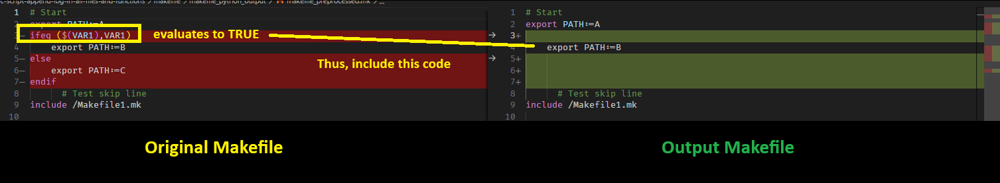
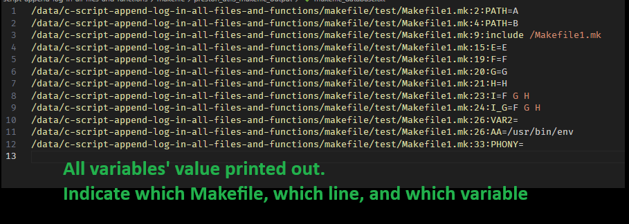

# Makefile Utility

# What




TL;DR
1. This script will generate 2 files
- Preprocessed file (all guarding such as `ifeq` will be evaluated & decide which part of code to be included)
- Database file (all those variables value will be printed out)
2. Output will be generated in the `preston_utils_makefile_output` in the current directory that you executed this script

# How to use
1. Run command
```bash
python3 [path to this main.py script] [path to your Makefile] ["the makefile command you have to pass, with DOUBLE QUOTE!"]
```
4. Example,
- You currently at `/data/repo/`
- You have a makefile `Makefile` at `/data/repo/Makefile` to build your program.
- You have this `main.py` script at `/data/preston_utils/makefile/main.py`
6. To build your program, this is the command you type, at `/data/repo/Makefile`
```bash
make OS_TARGET=Linux
```
7. Then, to trigger this program with this command, at `/data/repo/Makefile`
```bash
python3 /data/preston_utils/makefile/main.py /data/repo/Makefile "OS_TARGET=Linux"
```
8. The output of this script will be at `/data/repo/preston_utils_makefile_output`
